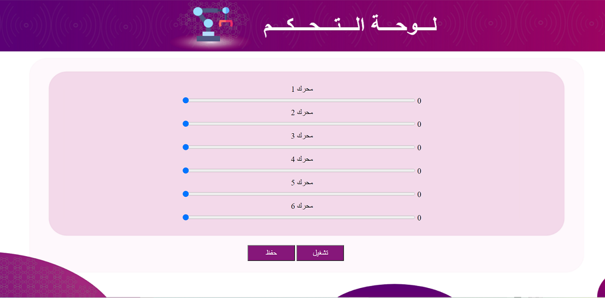
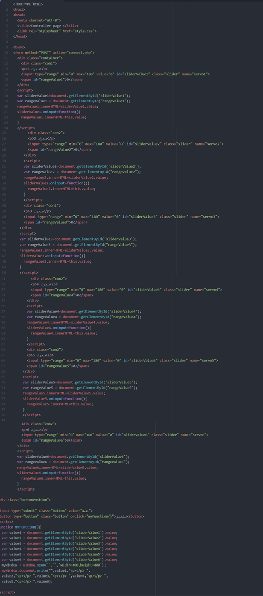
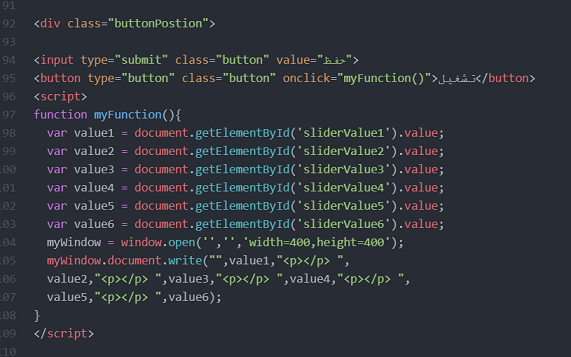
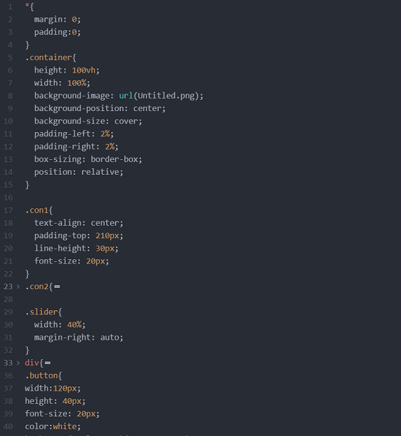
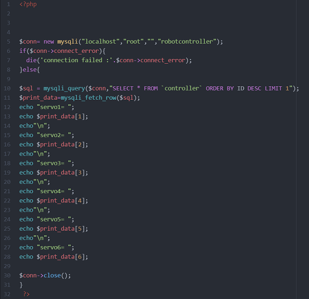
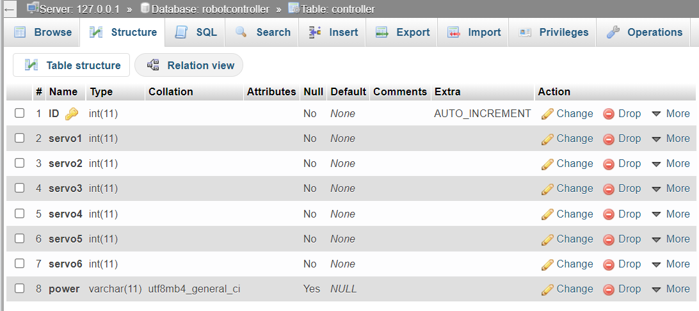

# * Control Panel For a Robot Arm * 

This repository is about an interface to control a robot arm.

 ## Description 

This project is an interface of a control panel made to move a robot arm.

There are four pages in this repository and a database

#### 1. ConntrolPanel.html:
 
This page include the code for html starting from linking the page with the css page for the layout, then linking it with the php page that includes the functional methodes.
there are 6 servo in the arm thats why there are 6 range sliders, each slider is spreated by div. The slider values ranges between 0 and 180. 
Each slider has a uniqe name to ease the process of sending the values to php page.
the last commands in the html page is the buttons, there are two buttons one for saving the values from the range sliders to the database at mySQL and the other is to display the values in seprate page.

#### 2. style.css:

This page include the design of the elements on the html page like the background, fonts and the layout style.

#### 3. connect.php:

This page connect the values of the servos to the database and if the values are sucessfully saved a page will appear with the saved values.

#### 4. lastRecord.php:

This page retrive the last row in the database and display it.

#### 5. robotcontroller.sql:

This is the database file.

